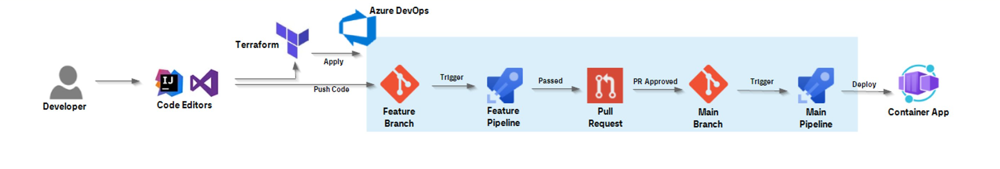
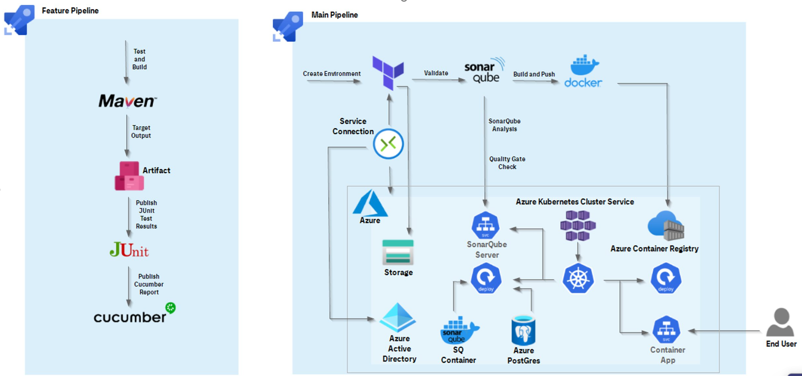
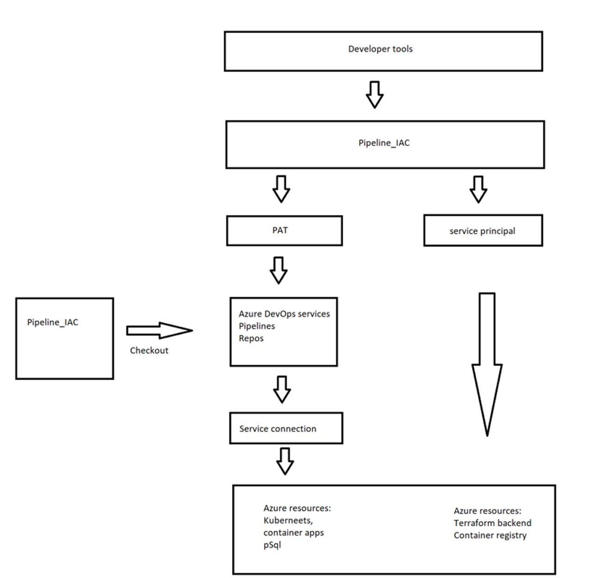


This scripts creates pipeline in Devops portal, cloud environment during pipeline runtime and deploy application container to kubernetes.

## Following definitions will be created:

Azure Devops environment

Repos and policy 

Pipelines including policy, junit, lint, sonarqube tests

Environment in Azure portal (kubernetes, pSql, ACR, analytics, Sonarqube server & configuration)

Pipeline stages: Cloud provision, Validation, Deployment, Destroy.

## Pipeline functionality:

#### Feature branch:

run all tests that possible without environment

lint,
build,
unit,
story acceptance (Gherkin / Cucumber) ...

save the HTML reports produced by the tests to the CI tool (or somewhere else),

report all run steps to GIT commit and link HTML reports there

prevent the branch from being merged into the master if even one test fails

#### Master branch:

all above

sonarqube analysis

retrieve information from that analysis and reports its status to git commit

stop if the test fails

build container

take it to artifactory / repository

install the code using Container App in the dev environment

#### Workflow process:



#### Schema

## Environment installation

Provide the personal access token (PAT) for the Azure DevOps organization, service principal and client secret. You can create a PAT token by following the instructions [here](https://docs.microsoft.com/en-us/azure/devops/organizations/accounts/use-personal-access-tokens-to-authenticate?view=azure-devops&tabs=preview-page).


Configure following env variables:
```bash 
# PowerShell
> $env:ARM_CLIENT_ID = "00000000-0000-0000-0000-000000000000"
> $env:ARM_CLIENT_SECRET = "12345678-0000-0000-0000-000000000000"
> $env:ARM_TENANT_ID = "10000000-0000-0000-0000-000000000000"
> $env:ARM_SUBSCRIPTION_ID = "20000000-0000-0000-0000-000000000000"
> $env:AZDO_PERSONAL_ACCESS_TOKEN  = "000000000000000000000000"
> $env:AZDO_ORG_NAME="DevOpsOrgName"

``` 

## Quick installation

```bash 
./scripts/init.ps1
``` 

Find on output repo URL.

## Manual installation

Initialize local state using the following commands:
```bash 
terraform init
``` 
Install remote backend:
```bash 
terraform apply -auto-approve -target="module.backend"
```
Migrate state
```bash 
terraform init -migrate-state 
```


## Usage

Setup ADO resources using the following commands:
```bash 
terraform apply -auto-approve -target="module.ado"   
```
Clean up:
```bash
terraform apply -destroy -auto-approve -target="module.ado"   
```

Sync with created repo

```bash 
git init
git remote add origin <url>
git fetch --all
```
Restart IDE.

Do not commit files to main branch as it is locked and prevented from merge, only pull request is possible. Checkout firstly "feature" branch and commit and push all files.

